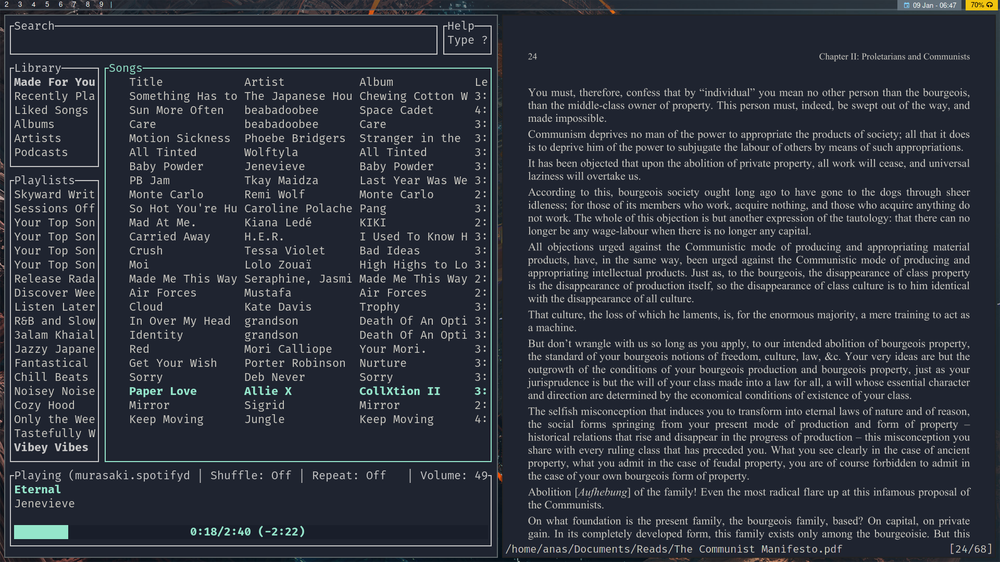

# dotfiles

Amalgamation of things that I've tweaked (mostly copied then tweaked slightly) enough, that I don't want to lose them and have to redo them.

### Info
- **WM:** [sway](https://github.com/swaywm/sway)
- **OS:** [Arch (manjaro)](https://manjaro.org/)
- **Terminal:** [kitty](https://github.com/kovidgoyal/kitty)
- **Shell:** [fish](https://github.com/fish-shell/fish-shell)
- **Panel:** [waybar](https://github.com/Alexays/Waybar/)
- **Editor:** [neovim](https://github.com/neovim/neovim/), based on [NvChad](https://github.com/NvChad/NvChad)
- **Browser:** [firefox](https://www.mozilla.org/en-US/firefox/new/)
- **Email Client:** [aerc](https://aerc-mail.org/)
- **Application Launcher:** [rofi](https://github.com/davatorium/rofi)
- **PDF Reader:** [zathura](https://pwmt.org/projects/zathura/)
- **Music Player:** [spotifyd](https://github.com/Spotifyd/spotifyd) + [spotify-tui](https://github.com/Rigellute/spotify-tui) 
- **Theme:** [ayu mirage](https://github.com/ayu-theme/ayu-vim)

### Screenshots

